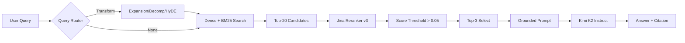

# Architecture — RAG Pipeline (Day 08 Lab)

> Template: Điền vào các mục này khi hoàn thành từng sprint.
> Deliverable của Documentation Owner.

## 1. Tổng quan kiến trúc

```
[Raw Docs]
    ↓
[index.py: Preprocess → Chunk → Embed → Store]
    ↓
[ChromaDB Vector Store]
    ↓
[rag_answer.py: Query → Transform → Retrieve → Rerank → Generate]
    ↓
[Grounded Answer + Citation]
```

**Mô tả ngắn gọn:**
Hệ thống Advanced RAG được xây dựng để hỗ trợ trả lời các thắc mắc nội bộ về quy trình vận hành (SOP), chính sách nhân sự (HR) và hỗ trợ kỹ thuật (IT Helpdesk). Hệ thống sử dụng kiến trúc kết hợp Hybrid Search (Dense + Sparse), Reranking và Query Transformation để đảm bảo câu trả lời chính xác, đầy đủ và luôn có trích dẫn nguồn (grounded).

---

## 2. Indexing Pipeline (Sprint 1)

### Tài liệu được index
| File | Nguồn | Department | Số chunk |
|------|-------|-----------|---------|
| `access_control_sop.txt` | it/access-control-sop.md | IT Security | 7 |
| `hr_leave_policy.txt` | hr/leave-policy-2026.pdf | HR | 5 |
| `it_helpdesk_faq.txt` | support/helpdesk-faq.md | IT | 6  |
| `policy_refund_v4.txt` | policy/refund-v4.pdf | CS | 6 |
| `sla_p1_2026.txt` | support/sla-p1-2026.pdf | IT | 5 |

### Quyết định chunking
| Tham số | Giá trị | Lý do |
|---------|---------|-------|
| Chunk size | 400 tokens (~1500 chars) | Đảm bảo mỗi chunk chứa đủ một tiểu mục hoặc điều khoản trọn vẹn. |
| Overlap | 80 tokens (~300 chars) | Giảm thiểu việc mất ngữ cảnh khi nội dung quan trọng nằm ở biên của chunk. |
| Chunking strategy | Heading-based + Paragraph | Tận dụng cấu trúc Section (=== Section ===) của tài liệu để chia đoạn logic. |
| Metadata fields | source, section, effective_date, department, access | Phục vụ filter, trích dẫn (citation) và xác định tính cập nhật của thông tin. |

### Embedding model
- **Model**: `jina-embeddings-v5-text-small` (1024 dimensions)
- **Vector store**: ChromaDB (PersistentClient)
- **Similarity metric**: Cosine (`hnsw:space: cosine`)

---

## 3. Retrieval Pipeline (Sprint 2 + 3)

### Baseline (Sprint 2)
| Tham số | Giá trị |
|---------|---------|
| Strategy | Dense (Jina AI Embeddings) |
| Top-k search | 10 |
| Top-k select | 3 |
| Rerank | Không |

### Variant (Sprint 3)
| Tham số | Giá trị | Thay đổi so với baseline |
|---------|---------|------------------------|
| Strategy | Hybrid (Dense + BM25) | Kết hợp semantic search và keyword matching. |
| Top-k search | 10 (mỗi loại) | Lấy rộng để đảm bảo recall tốt nhất từ cả 2 phương thức. |
| Top-k select | 3 | Giữ nguyên để tránh context window bị quá tải và nhiễu. |
| Rerank | Jina Reranker v3 | Sắp xếp lại dựa trên Relevance Score thực tế giữa Query và Chunk. |
| Query transform | Auto (Expansion/Decomp/HyDE) | Tự động chọn kỹ thuật tối ưu dựa trên loại câu hỏi. |

**Lý do chọn variant này:**
Nhóm chọn kết hợp Hybrid + Rerank vì tài liệu chứa nhiều mã lỗi (ERR-403) và thuật ngữ chuyên ngành (SLA, P1) mà Dense Search đôi khi bỏ lỡ. Reranking kèm ngưỡng threshold (0.05) giúp lọc bỏ context rác, đặc biệt hiệu quả với các câu hỏi "bẫy" không có thông tin trong docs.

---

## 4. Generation (Sprint 2)

### Grounded Prompt Template
```
Bạn là Chuyên gia hỗ trợ CNTT và Chăm sóc khách hàng chuyên nghiệp. 
Hãy trả lời câu hỏi của người dùng dựa TRỰC TIẾP vào phần 'Ngữ cảnh' dưới đây.

Quy tắc nghiêm ngặt:
1. Đảm bảo BAO QUÁT ĐẦY ĐỦ THÔNG TIN: Nếu ngữ cảnh có chi tiết về nhiều mốc thời gian, hãy đưa tất cả vào.
2. Với trường hợp đặc biệt không nhắc đến trong docs, hãy báo cáo rõ và áp dụng quy trình tiêu chuẩn.
3. Trích dẫn nguồn bằng [ID] ngay sau câu sử dụng thông tin.
4. Giữ câu trả lời súc tích, trả lời bằng Tiếng Việt.

Câu hỏi: {query}

Ngữ cảnh:
[1] {source} | {section} | score={score}
{chunk_text}

Answer:
```

### LLM Configuration
| Tham số | Giá trị |
|---------|---------|
| Model | `moonshotai/kimi-k2-instruct` (via Groq) |
| Temperature | 0 (đảm bảo tính ổn định và chính xác) |
| Max tokens | 1024 |

---

## 5. Failure Mode Checklist

| Failure Mode | Triệu chứng | Cách kiểm tra |
|-------------|-------------|---------------|
| Index lỗi | Retrieve về docs cũ / sai version | `inspect_metadata_coverage()` trong index.py |
| Chunking tệ | Chunk cắt giữa điều khoản quan trọng | `list_chunks()` và đọc text preview |
| Retrieval lỗi | Bỏ lỡ mã lỗi hoặc từ khóa kỹ thuật | So sánh Dense vs Hybrid trong `rag_answer.py` |
| Generation lỗi | LLM tự ý thêm thuật ngữ bên ngoài (hallucination) | `score_faithfulness()` trong eval.py (xem case q07) |
| Token overload | Context quá dài (lost in the middle) | Kiểm tra `len(context_block)` trước khi call LLM |

---

## 6. Diagram



