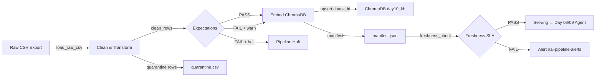

# Kiến trúc pipeline — Lab Day 10

**Nhóm:** Team Alpha
**Cập nhật:** 2026-04-15

---

## 1. Sơ đồ luồng



**Luồng file:**
```
data/raw/policy_export_dirty.csv
  → artifacts/cleaned/cleaned_<run-id>.csv
  → artifacts/quarantine/quarantine_<run-id>.csv
  → artifacts/manifests/manifest_<run-id>.json
  → chroma_db/ (ChromaDB persistent)
  → artifacts/logs/run_<run-id>.log
```

**Điểm đo freshness:** sau khi embed xong, manifest ghi `latest_exported_at` từ cleaned rows → `freshness_check.py` so sánh với SLA.

**run_id:** UTC timestamp format `YYYY-MM-DDTHH-MMZ`, truyền từ CLI `--run-id` hoặc tự sinh.

---

## 2. Ranh giới trách nhiệm

| Thành phần | Input | Output | Owner nhóm |
|------------|-------|--------|--------------|
| Ingest | `data/raw/policy_export_dirty.csv` | Raw rows (List[Dict]) | Ingestion Owner |
| Transform | Raw rows | Cleaned rows + quarantine | Cleaning & Quality Owner |
| Quality | Cleaned rows | Expectation results + halt flag | Cleaning & Quality Owner |
| Embed | Cleaned CSV + manifest | ChromaDB collection upsert | Embed Owner |
| Monitor | Manifest JSON | PASS/WARN/FAIL freshness | Monitoring / Docs Owner |

---

## 3. Idempotency & rerun

Pipeline sử dụng **upsert theo `chunk_id`** — mỗi chunk_id là SHA-256 hash (16 ký tự đầu) của `doc_id|chunk_text|seq`.

**Rerun 2 lần:**
- Lần 1: embed N chunks → collection có N vectors
- Lần 2: cùng dữ liệu → cùng chunk_id → upsert ghi đè, **không phình tài nguyên**

**Prune stale ids:** trước khi upsert, pipeline xóa các vector id trong collection nhưng **không còn trong cleaned run hiện tại** → đảm bảo index = snapshot publish, tránh "mồi cũ" trong top-k retrieval.

---

## 4. Liên hệ Day 09

Pipeline này cung cấp corpus cho retrieval trong `day09/lab`:
- Cùng `data/docs/` directory (5 files: refund, SLA, FAQ, HR, access)
- Collection ChromaDB **tách biệt**: `day10_kb` (Day 10) vs collection Day 09
- Agent Day 09 có thể trỏ sang `day10_kb` để đảm bảo retrieval trên dữ liệu đã qua quality gate
- Khi policy PDF thay đổi → rerun `etl_pipeline.py run` → index tự động cập nhật với cùng chunk_id strategy

---

## 5. Rủi ro đã biết

| Rủi ro | Tầng | Mitigation |
|--------|------|------------|
| CSV export stale (>24h) | Ingest | Freshness SLA alert + manifest check |
| Duplicate chunk từ nhiều export batch | Transform | Dedup bằng `_norm_text()` + quarantine |
| Stale HR policy version conflict | Transform | Quarantine nếu `effective_date < 2026-01-01` |
| Refund window 14 ngày (lỗi migration) | Transform | Auto-fix 14→7 ngày cho `policy_refund_v4` |
| PII leak vào chunk_text | Transform | Quarantine rows chứa email/phone pattern |
| Embedding model drift | Embed | Fixed model `all-MiniLM-L6-v2`, version lock |
| ChromaDB phình tài nguyên sau nhiều rerun | Embed | Prune stale ids trước upsert |
| Expectation halt block pipeline | Quality | `--skip-validate` cho demo có chủ đích |
